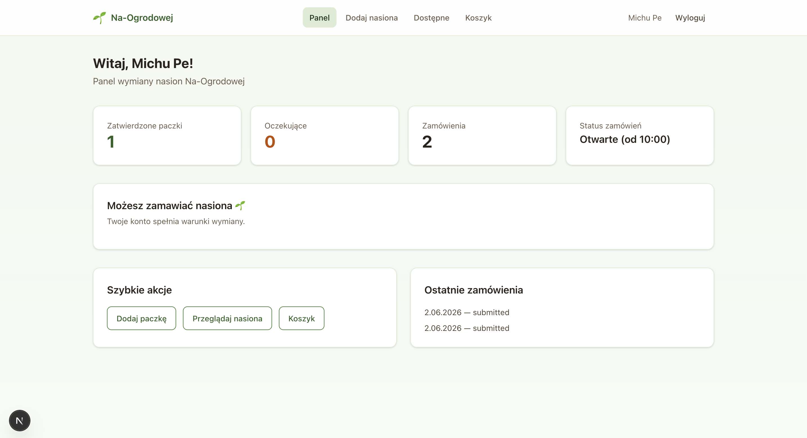
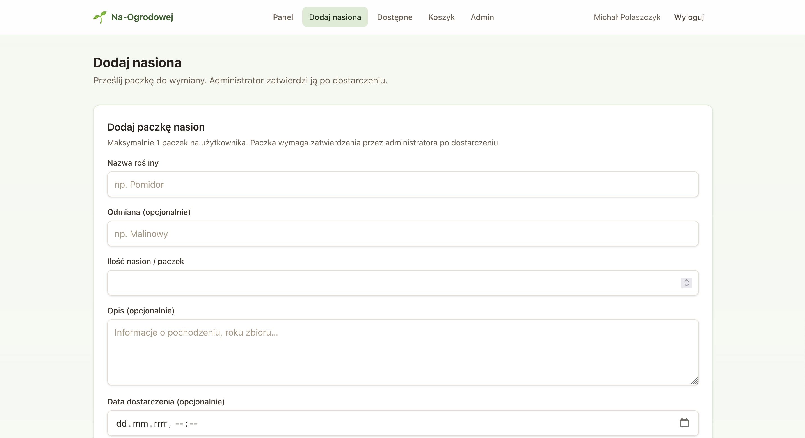
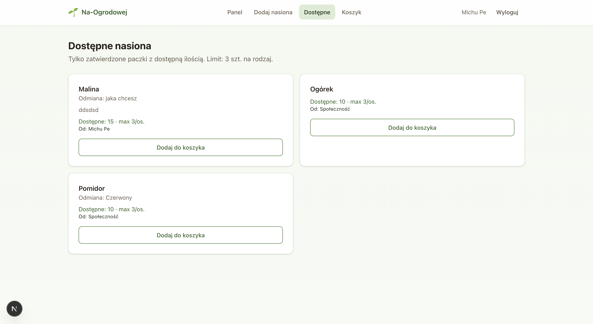
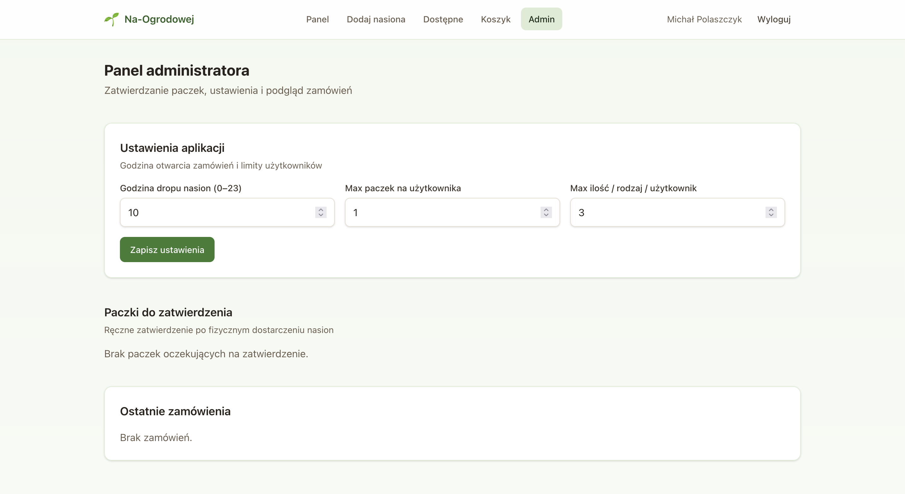

# Na-Ogrodowej 🌱

Community-driven seed exchange platform built with Next.js, TypeScript and Supabase.

Users contribute seed packages, complete their shipping profile and participate in a fair exchange system managed by administrators.

---

## Features

### User Features

- User registration and authentication
- Shipping profile management
- Add seed packages for exchange
- Browse available seeds
- Shopping cart
- Place seed exchange orders
- Order history
- Exchange eligibility validation

### Admin Features

- Admin dashboard
- Approve or reject submitted seed packages
- Delete packages
- Manage users
- Configure exchange settings
- Review orders

---

## Exchange Rules

To participate in seed exchange a user must:

- Complete shipping information
- Submit at least one seed package
- Have at least one approved package
- Have an active account
- Order during available exchange hours

---

## Tech Stack

- Next.js 15
- TypeScript
- Tailwind CSS
- Supabase
- Zustand
- Zod

---

## Screenshots

### User Dashboard



### Add Seed Package



### Available Seeds



### Shopping Cart


### Admin Dashboard



---

## Project Structure

src/
├── app/
├── components/
├── lib/
├── stores/
├── types/
└── middleware.ts

---

## Installation

```bash
git clone https://github.com/USERNAME/wymiana-na-ogrodowej.git

cd wymiana-na-ogrodowej

npm install

npm run dev
