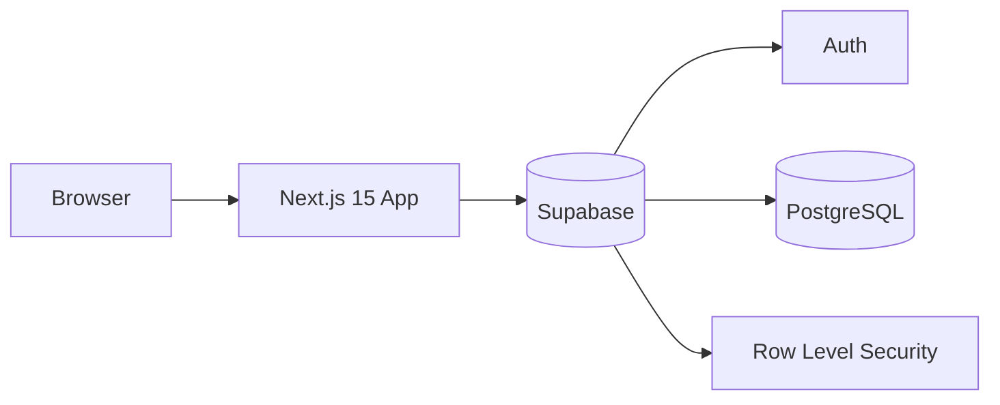
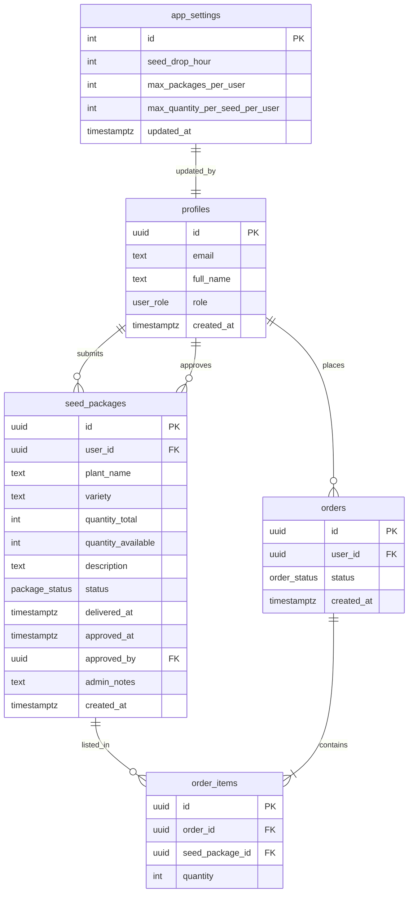

# Na-Ogrodowej — Architecture & Development Plan

## 1. Vision

**Na-Ogrodowej** is a community seed-exchange MVP: users contribute seed packages, admins verify deliveries, and approved inventory becomes orderable by other members who have contributed at least once.

## 2. Principles

| Principle | Decision |
|-----------|----------|
| Simplicity | Monolith: single Next.js 15 app (UI + API routes + server actions) |
| MVP scope | No microservices, no nginx, no real-time chat, no payments |
| Scalability path | Clear module boundaries, Supabase RLS, typed contracts |
| Type safety | TypeScript end-to-end (app, DB types, Zod validators) |
| Local dev | Docker Compose with named volumes and fixed container names |

## 3. System Context



- **Next.js 15** (App Router): pages, layouts, Server Actions, Route Handlers
- **Supabase**: PostgreSQL, Auth (email/password), RLS policies
- **Zustand**: client cart + lightweight UI state
- **Tailwind CSS**: responsive green/gardening UI

## 4. Project Structure

```
na-ogrodowej/
├── docker-compose.yml
├── Dockerfile                 # production multi-stage
├── Dockerfile.dev             # development multi-stage
├── docs/
│   └── ARCHITECTURE.md
├── supabase/
│   └── migrations/            # SQL schema + RLS
├── public/
├── src/
│   ├── app/
│   │   ├── (auth)/login, register
│   │   ├── (app)/dashboard, seeds/add, seeds/available, cart, admin
│   │   ├── api/                 # minimal route handlers if needed
│   │   ├── layout.tsx
│   │   └── globals.css
│   ├── components/              # UI primitives + feature components
│   ├── lib/
│   │   ├── supabase/            # client, server, middleware helpers
│   │   ├── actions/             # server actions (business logic)
│   │   └── validators/          # Zod schemas
│   ├── stores/                  # Zustand (cart)
│   └── types/                   # shared TS types + DB types
├── .env.example
└── README.md
```

## 5. Database Schema (Relational)



### Enums

- `user_role`: `user`, `admin`
- `package_status`: `pending`, `approved`, `rejected`
- `order_status`: `submitted`, `approved`, `packed`, `shipped`, `cancelled`

### Business rules (enforced in app + RLS where possible)

1. User must have ≥1 **approved** `seed_packages` row before placing an order.
2. `quantity_available` decrements on order; listings filter `status = approved AND quantity_available > 0`.
3. Per-user cap per seed: `max_quantity_per_seed_per_user` from `app_settings` (default 3).
4. Per-user cap on contributions: `max_packages_per_user` from settings.
5. Admin manually sets package to `approved` after physical delivery.
6. `seed_drop_hour` (0–23): orders only accepted when current hour ≥ configured hour (server-side check).

## 6. Authentication Flow

1. Register → Supabase `signUp` → trigger creates `profiles` row (`role = user`).
2. Login → `signInWithPassword` → session cookie via `@supabase/ssr`.
3. Middleware refreshes session and protects `(app)` routes.
4. Admin routes check `profiles.role = admin`.

## 7. Feature Implementation Order

| Phase | Deliverable |
|-------|-------------|
| 1 | Repo scaffold, Docker, env template |
| 2 | SQL migrations, RLS, profile trigger |
| 3 | Auth pages + middleware + session |
| 4 | Layout, navigation, forms, dashboard shells |
| 5 | Seed CRUD, listings, cart (Zustand), orders, admin approval, settings |

## 8. API / Business Logic Layer

- **Server Actions** (`src/lib/actions/*`): primary mutation path from forms.
- **Supabase server client**: used in actions and RSC data fetching.
- **Zustand**: cart only (persisted to `localStorage`).

No separate REST microservice.

## 9. Docker Strategy

| Service | Container name | Purpose |
|---------|------------------|---------|
| `app-dev` | `na-ogrodowej-app-dev` | `next dev`, hot reload, bind mount + `node_modules` volume |
| `app-prod` | `na-ogrodowej-app-prod` | `next start` production image (profile `prod`) |

Volumes:

- `na-ogrodowej-node-modules` — isolated `node_modules`
- `na-ogrodowej-next-cache` — `.next` cache (dev)

Supabase runs **outside** this compose (cloud or `supabase start` locally); app connects via env vars.

## 10. Security (MVP)

- RLS on all tables; users read/write own data; admins via `is_admin()` helper.
- Service role key **never** exposed to browser.
- Zod validation on all server actions.
- CSRF: Next.js Server Actions default protection.

## 11. Out of Scope (MVP)

- Email notifications, image uploads, maps, messaging
- Automated inventory sync with external systems
- Payment / shipping integrations
- nginx reverse proxy, Kubernetes

## 12. Future Extensions

- Supabase Storage for seed photos
- Edge functions for scheduled drop-hour notifications
- PWA + offline cart
- Audit log table for admin actions
